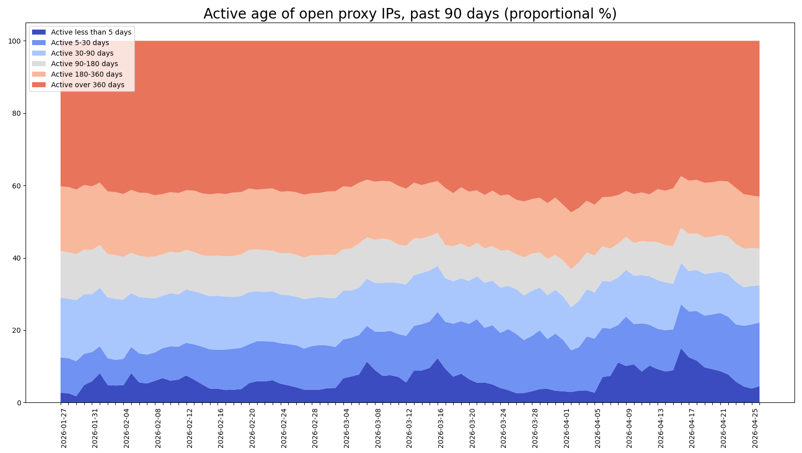

# hopm-conf

Auto-generated **HOPM (Hybrid Open Proxy Monitor)** scanner block snippets: curated `protocol:port` lists based on confirmed open-proxy detections.

Copy/paste into HOPM `scanner { ... }` blocks to keep coverage current without hand-maintaining port lists.

> **Start with Top 50** for a good balance of coverage vs. scan load.

## Files

| File | Description |
|------|-------------|
| [`hopm_scanner_protocol_top_50.conf`](./hopm_scanner_protocol_top_50.conf) | Top 50 protocol:port pairs — recommended default |
| [`hopm_scanner_protocol_top_100.conf`](./hopm_scanner_protocol_top_100.conf) | Top 100 — broader coverage, more scan load |
| [`hopm_scanner_protocol_top_200.conf`](./hopm_scanner_protocol_top_200.conf) | Top 200 — maximum coverage, highest load |

## Data source

Derived from continuous scanning in support of defensive blocklist/RBL workflows ([DroneBL](https://dronebl.org/), [EFnetRBL](https://rbl.efnetrbl.org/)). Updated **weekly**, or more frequently if protocol:port composition shifts significantly.

## Trends (past 90 days)

  
*Top detected protocol:port pairs by unique IP count.*

  
*How long detected proxies have remained active.*

## Responsible use

HOPM performs active proxy checks on connecting clients. Use only where you have legitimate defensive need and permission to scan. Start conservative (Top 50), log scans, and be prepared to respond to abuse reports.

## License

MIT — provided as-is, no warranty.

## Contact

[mannfred.com](https://mannfred.com) · [mannfred@gmail.com](mailto:mannfred@gmail.com)
