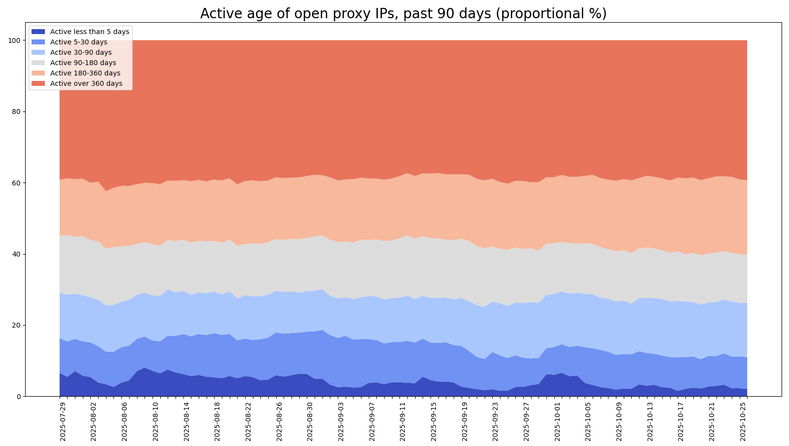

# hopm-conf
Automatically Generated HOPM (Hybrid Open Proxy Monitor) Scanner Configurations

&nbsp;

## Description

This repository contains automatically generated scanner block configurations for the [HOPM](https://github.com/ircd-hybrid/hopm) project. Lists for Top 50, Top 100, and Top 200 confirmed open proxy protocol-port pairs are provided. These should be possible to copy/paste directly into the HOPM scanner block configuration. For typical setups the Top 50 list should yield a good tradeoff between scanner coverage and resource consumption.

| Category | List |
| :---  | :---  |
| Top 50 | [hopm_scanner_protocol_top_50.conf](https://github.com/MannfredCom/hopm-conf/blob/main/hopm_scanner_protocol_top_50.conf)
| Top 100 | [hopm_scanner_protocol_top_100.conf](https://github.com/MannfredCom/hopm-conf/blob/main/hopm_scanner_protocol_top_100.conf)
| Top 200 | [hopm_scanner_protocol_top_200.conf](https://github.com/MannfredCom/hopm-conf/blob/main/hopm_scanner_protocol_top_200.conf)

The data originates from active 24/7 scanning on behalf of Reverse DNS blocklists (RBLs) and is verified/auditable. The lists and trends are updated weekly, but updates will occur more frequently in the event of significant shifts.

&nbsp;

## Recent Trends

<i>Fig 1. Top Protocol:Port pairs detected over the past 90 days. Typically the composition does not change much from one month to another, but notable spikes do occur from time to time.</i> 

<i>Fig 2. The stability of open proxy IPs over the past 90 days. A substantial percentage of proxies detected today have been active on the same IP even a year ago. This fact may support the argument for longer proxy banlist expiration times.</i> 

&nbsp;

## Contact

For general comments or questions e-mail is preferred!

* Web: [Thomas M. Carlsson](https://mannfred.com/)
* E-mail: [mannfred@gmail.com](mailto:mannfred@gmail.com)
  
  
