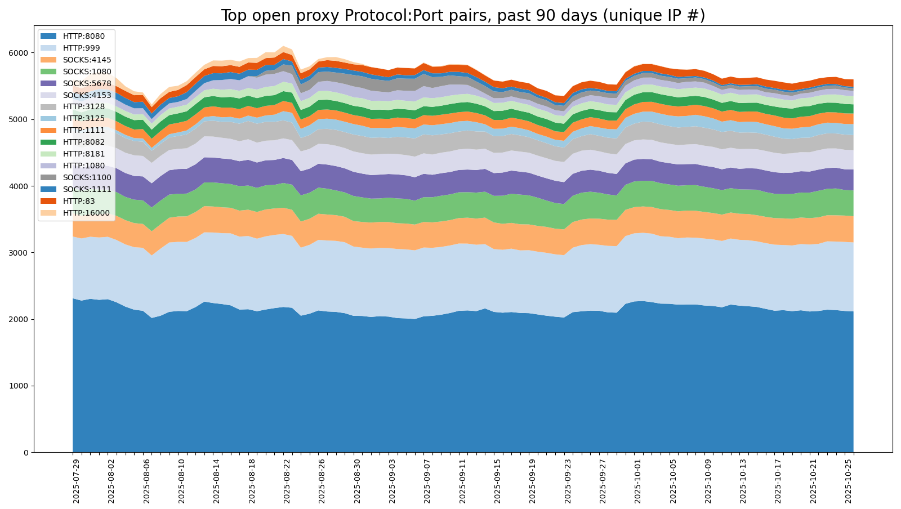

# hopm-conf
HOPM (Hybrid Open Proxy Monitor) Scanner Configurations

### Description

This repository contains automatically generated scanner block configurations for the [HOPM](https://github.com/ircd-hybrid/hopm) project. Lists for Top 50, Top 100, and Top 200 confirmed open proxy protocol-port pairs are provided. These should be possible to copy/paste directly into the HOPM scanner block.

| Category | List |
| :---  | :---  |
| Top 50 | [hopm_scanner_protocol_top_50.conf](https://github.com/MannfredCom/hopm-conf/blob/main/hopm_scanner_protocol_top_50.conf)
| Top 100 | [hopm_scanner_protocol_top_100.conf](https://github.com/MannfredCom/hopm-conf/blob/main/hopm_scanner_protocol_top_100.conf)
| Top 200 | [hopm_scanner_protocol_top_200.conf](https://github.com/MannfredCom/hopm-conf/blob/main/hopm_scanner_protocol_top_200.conf)

The data originates from active scanning on behalf of the [rbl.efnet.org](https://rbl.efnetrbl.org/) DNS blocklist. The data is verified and up-to-date.

### Recent Top Trends

### Contact

* E-mail: [mannfred@gmail.com](mailto:mannfred@gmail.com)
* Web: [Thomas Mannfred Carlsson](https://mannfred.com/)
